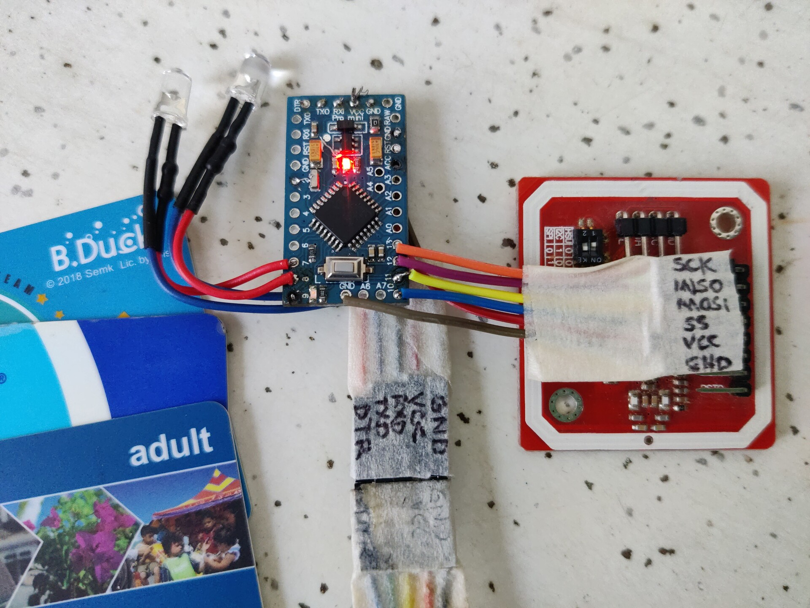

This simple sketch is intended to be used for a simple proximity card reader
system.  For instance, for access to a hack space.

## Software Setup:

### Arduino IDE
- You will need the correct PN532 library:
    https://github.com/hamishcoleman/arduino_pn532
  Make this library available to your arduino environment in its usual ways.
  (Note that if you have the upstream Adafruit_PN532 library, then there will
  be conflicts, so remove the other one first)
- This sketch should compile and verify cleanly

### Building from the CLI
In order to support traditional software development and make it easier to
build CI systems, this project also has a Makefile to build it.

Install the dev tools and required library:
```
make bin/arduino-cli hack_install_core hack_install_lib
```

Other build targets:
- `make all`
- `make clean`
- `make upload`

## Hardware Setup:
- Get a PN532 module (many suitable are available online)
- Wire up the Arduino Hardware SPI port to the PN532
- Optionally, connect LEDs to Arduino Pins 7 and 8

## Example output:
After programming, the serial console will show detected cards:

```
sketch=/home/runner/work/arduino_cardreader/arduino_cardreader/arduino_cardreader.ino
Found chip PN532
Firmware ver. 1.4
Waiting for a Card ...
tag=20/0435178A597532
tag=NONE

tag=20/AF8E8E13
tag=10/E2E2F98B
tag=NONE

```

This example shows two reads.  Firstly, an oyster card is held up and then
removed.  Secondly, both a Translink Go card and a Shenzhen metro card are
held up at the same time - showing simultaneous detection and reading.

## Communications Protocol

All communications (both input and output) are intended to be both useful for
humans to view and debug and simple for a machine to reliably parse the data.

All messages (both input and output) are framed with a start and a stop
character.  The message starts with a STX (0x02) char and ends with a EOT
(0x04) char.

Any text received before an STX char or after an EOT char should not be
interpreted.  This allows debugging output or informational text to be
easily intermixed with operational messages.

Currently, the message format is printable text only and thus there is no
need to escape any control characters.

Each message is comprised of a "tag" and a "value", separated by an "="
character.

This format is expected to evolve after more testing.

### Message "tag="

This status output is the main use for this project.  This shows the unique hex
ID determined from the cards presented to the reader.

The special tag "NONE" indicates that there is no longer any card in front
of the reader.

Currently, if a card is held to the reader for an extended time, this message
will repeat for as long as the card is held up - this may change to avoid
repeating identical values in the future.

The card tag is prefixed with the detected card type to keep the (sometimes
quite small) ID name space separate for each type of RFID hardware.  Currently,
this card type is an internal PN532 identifier, which probably needs to change.

### Message "rawtag="

When enabled, this status output allows for possible further processing of the
card data, sending a hexdump of the raw data for this tag.

This message defaults to disabled and needs to be enabled with the "t" command.

### Message "raw="

When enabled, this status output is used for detailed debugging, sending a
large chunk of the InAutoPoll response PDU is output.

This message defaults to disabled and needs to be enabled with the "r" command.

### Commands

A number of simple commands can be sent to manage the device.  When using a
serial terminal, the message framing can be added by starting with a `Ctrl-B`
and ending with a `Ctrl-D`

| command | Action |
| ------- | ------ |
| H | Sends a quick hello debug text back to the user |
| 0 | Turns off both LEDs |
| 1 | Turns LED1 on |
| 2 | Turns LED2 on |
| 3 | Blinks LED1 |
| 4 | Blinks LED2 |
| 5 | Blinks LED1 out of phase |
| 6 | Blinks LED2 out of phase |
| 7 | Blinks both LEDs, one in each phase |
| r | Enable raw= messages |
| R | Disable raw= messages |
| t | Enable rawtag= messages |
| T | Disable rawtag= messages |

Note: The led status will last for 20 seconds before being turned back off
again.  If the output is needed for longer, then the command needs to be
repeated.

## Example wiring:


